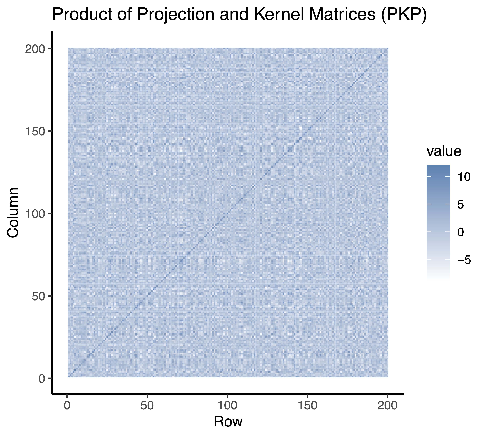

# Genotype analysis algorithms using SKAT, ACAT, and other

This repository contains my implementations of the main algorithms from SKAT, ACAT, and other related methods. The aim is to fully understand their workings and validate them through practical testing.

See <https://github.com/leelabsg/SKAT> for more information.

## Repository Structure

- `src`: Contains the source code for the implementation of the algorithms.
- `data`: Sample data files used for testing and examples.
- `images`: Stores visualizations of results and intermediate steps.
- `scripts`: R scripts to execute different analysis scenarios.

